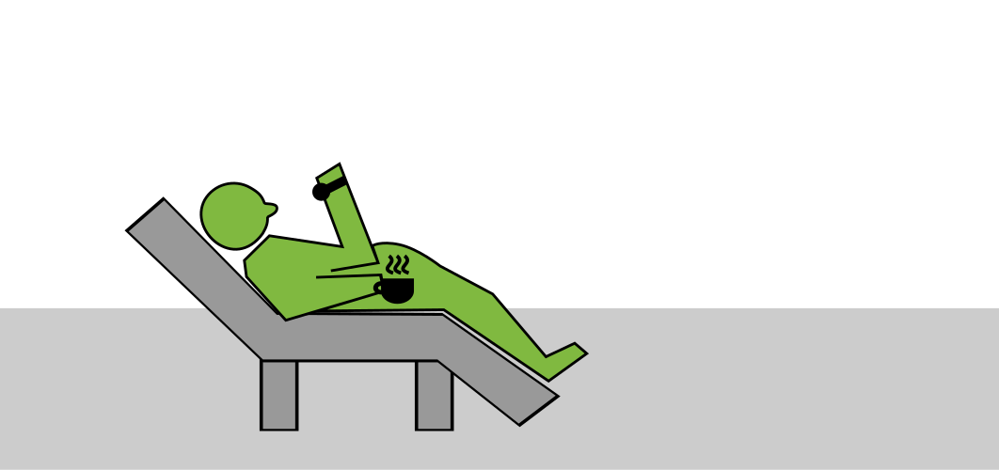

# How to handle passive participants?

## Find out what they need

* take a break
* ask for their expectations
* find out whether they are frustrated (too difficult) or bored (too easy)
* do a longer formative assessment at the end of the lesson and before the next

## If they think it is too difficult

* give them more things to do actively
* go for an easy success
* do a slow live coding session
* do a step-by-step coding exercise
* focus on getting one thing done
* collect all concepts and summarize them as a table

## If they think it is too easy

* use a stopwatch during exercises
* hand out programming challenges
* do a hotseat kata
* organize a coding competition in teams
* let them present their results

## Add extra sensory stimulation

* play music during the breaks
* decorate the training room
* use a strong metaphor
* draw a super nice poster
* address all senses
* sweets etc
* do a small physical exercise / energizer after the break

## If single participants refuse to participate

* don't say *"maybe"*
* address disturbance
* talk to them one-on-one (but do not announce it)
* state your point clearly
* understand them
* avoid loaded terms ("roleplay", "groupwork" etc.)
