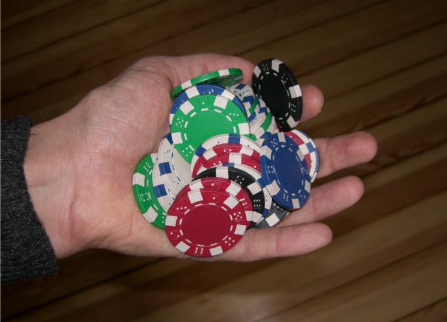

# Voting with Poker Chips

While organizing the [RuPy conference](http://rupy.eu), we wanted to know how well our speakers performed. Web forms or a survey on paper seemed too clumsy, we wanted feedback right after the speeches.

### What we did

We bought a few freezer boxes, labeled them with smileys ( :-) , :-| , and :-( ), and placed three boxes at each exit of the lecture halls. Then we placed a pile of poker chips in front of them. Our guests figured out how to use them right away - as you walk out, throw a chip in a box depending on how well you liked the talk.

Then, one of the organizers counted the chips, and emptied the boxes after each talk. The results were mixed and brutally sincere - almost too sincere. It was good we had informed our speakers in advance what we were planning to do. The approach gives you numbers but it does not provide any constructive suggestions.

At various other occasions, I used chips to let people vote on a number of alternatives. This worked fine and if no **good-bad** decisions are made, the method is emotionally safe. Thus, poker chips can help you as a **voting procedure** that requires very little time to prepare. 