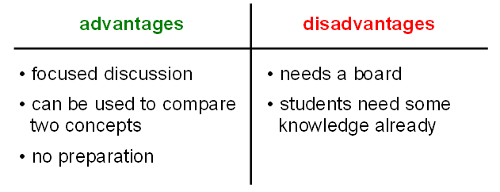

# Facilitated Discussion

| summary     | record the outcomes of a discussion |
|-------------|---------------------------|
| time        | 10'-30' |
| preparation | 5' |
| group size  | 2-50 |
| material    | whiteboard, flipchart or spreadsheet |

----

### How it is done

In a facilitated discussion, you want to set the topic and prevent the discussion drifting into random directions.

To get the group to participate, you need a clear goal.
Often, it is one of the following:

* collect pros and cons
* compare two concepts
* collect ideas

Your job as a facilitator is to record results make sure as many people as possible get the chance to talk.
Write a concept or statement on top of the board. Divide the remainder into two columns labeled **pros/cons, advantages/disadvantages**, or simply **ideas**. You ask the group to provide input for each of the columns. You collect answers, write them down, and moderate the discussion.

When you run out of space on the board, it is the right time to end the discussion.

----

### Example Questions

* How to clean code?
* Jupyter notebooks vs. Text editors
* PostgreSQL vs. MongoDB
* Should you use classes?

----
### Comments

To work well, your group should be familiar with the topic already. You can connect to previous knowledge, or draw conclusions from something you did in your lesson. 

You can use the Pro-Con method to compare two technologies, models, Python libraries or anything else – just label the columns accordingly. This works perfectly, if your participants worked in two groups, each exploring one of the two contrasting aspects.

Facilitated discussions are a valuable tool in meetings or decision-making situations as well. In teaching, it is a good way to wrap up a lesson, because your group needs to recapitulate what they did before. 
