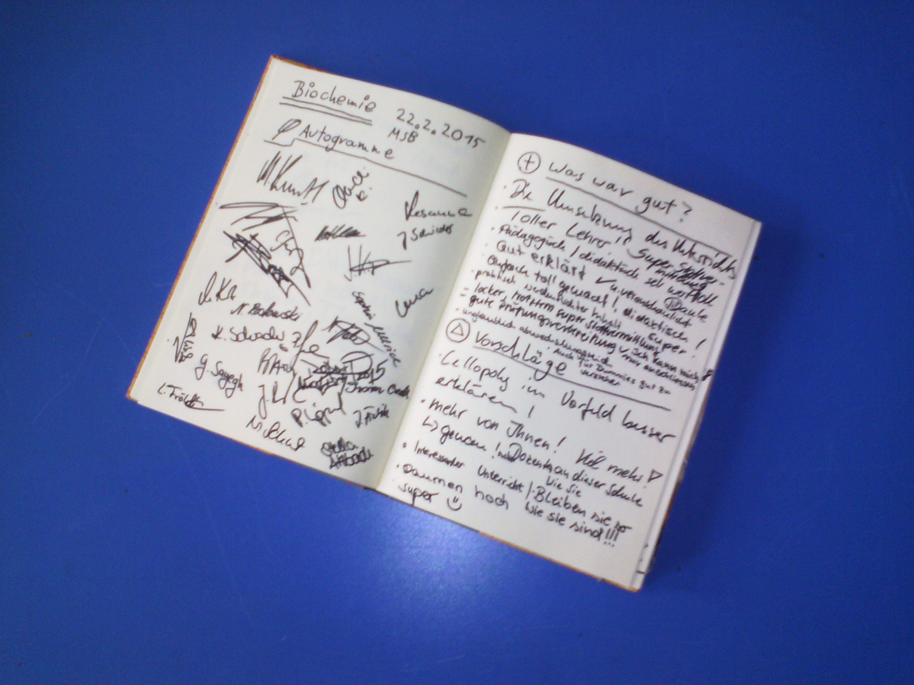
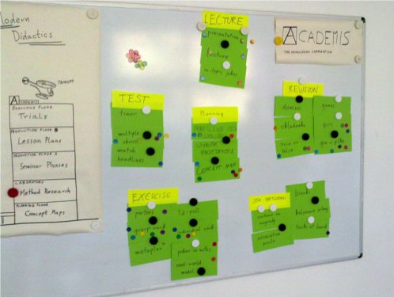

# Feedback Methods

Over 4 years, I brought a guest book to my trainings to collect comments and autographs of participants. You might want to collect feedback after a lesson or course for various other reasons:

* find out what your participants learned
* make your participants aware of what they learned
* find out what to prepare for the next lesson
* improve a future edition of your course
* benchmark different courses against each other
* help participants to close the course mentally

In this chapter you find my favourite methods.

| technique | description |
|-----------|-------------|
| Questionnaire | Share and collect a sheet with questions. Very formal but accurate feedback. Provides the best values when other trainers get the same questionnaire and you can compare results. |
Dot Voting | Stick dots or place tokens in order to prioritize topics. See [www.academis.eu/posts/dot-voting](http://www.academis.eu/posts/dot-voting). |
Review expectations | If you collected written expectations at the beginning of the course, review them together at the end. See [www.academis.eu/posts/collect-and-review-expectations-your-students](http://www.academis.eu/posts/collect-and-review-expectations-your-students). |
Fridge | Take a round answering a question *"What would you tell your (fridge/cat/kids) about the training day?"* |
Free drawing | Place a sheet of flipchart paper on a table and ask participants to write or draw a summary of the course. |

## Online feedback tools

Easy to evaluate, but less immediate than a questionnaire on paper. To prevent your survey landing in the trash bin allocate time before the end of the training to fill the form.

* Typeform
* NBGrader
* [Tweedback](http://twbk.de)
* [Socrative.com](http://socrative.com)

### Other

* Feedback: 1Up, 1Down, no repeat
* 5 cards: I liked.., I find useful, I struggle with, question, suggestion
* Speedboat
* Plakat mit Feldern zu moeglichen Interessen. Chips verteilen.
* Headlines	TN oder Paare schreiben eine 'Zeitungsüberschrift' zu einem Thema auf
* Postkarten		
* Treasure box	hints for the next batch
* Fragen mit Handzeichen	Fragen mit zwei Antworten, durch Handheben abfragen
* wenn <name> ein <auto> wäre wäre er ein <attribut>
* ask about pairs of items: what is more important -> priorities
* wish box

### Useful questions

Questions you might ask after a training (e.g. using the *four-corner* method include:

* What did you like about the training?
* What frustrated you?
* What did you find exciting?
* What are you going to try next?
* What are your wishes for the next day/session?
* What can you apply right away?
* What did you find difficult to understand?
* What would you like to learn more about?
* What else would you like to learn?
* What would you like to tell the trainer?

# Round Robin questions

1. Form a circle
2. Visualize a few questions to ask**
3. **Everybody** gets an opportunity to say something

## Sample questions:

* How will other people know that you have been in this course?
* What was fun for me?
* What was difficult for me?
* What did I find useful?
* I found it surprising that..
* I would like to comment that..
* I would have liked more about..
* I was bored when..
* I found interesting..
* What I really liked..
* Something else I want to say..

## Collect Feedback with a Voting Box

#### Summary
collect cards with feedback in a box

#### Preparation time
none

#### Group size
up to 30

#### What do you need?
small pieces of paper, a box or hat

#### How it is done

Write an open question on the board, e.g.:

*“What would you like to learn tomorrow?”*

Share small pieces of paper among the students. Give them some time to write down something and collect the paper pieces in the box. Evaluate the answers. If you are collecting feedback, start reading the answers only **after all students are out of sight**.

You can use this feedback technique to collect ideas and suggestions from a passive group. For instance, when your lessons start very late, when students have a lot of respect towards you, or when there is a language barrier. The method also helps if your group is heterogeneous or dominated by a few active trainees.
our ego.

I often use this kind of poll for getting feedback after the first few days of a course, and prepare the rest of the course to the answers. It is a foolproof method that you can apply spontaneously.
It works much better than suggestive quesions like *"How do you like the course so far?"*.

## Dot Voting

Which topics in a course should be revisited, repeated, or explained in more depth? In many courses, I let participants choose from up to 50 possible options within five minutes. Here is how:

### How to do it
Using sticky dots you can find out quickly what is most relevant to your students. You need to:

1. Visualize all available topics on paper cards or a board.
2. Explain the task, e.g. *“Stick dots on topics we should repeat tomorrow.”*
3. Distribute 3-5 dot stickers to each participants. Students will stick on their dots by themselves.

The entire procedure should take less than five minutes.

### Advantages
The dot voting procedure works with flipchart paper, cards on a pin board or even post-its. On a big pin wall, you can vote on 50 items simultaneously. You are not restricted to dot stickers. Magnets and even making crosses with pens works well.

### Caveats
It is better to explain the task first and then distribute the dots. Otherwise it creates disturbance.

### What else?
Dot voting works in many different moderation scenarios, not only in teaching. You can find an alternative description on [www.gamestorming.com/core-games/dot-voting/](http://www.gamestorming.com/core-games/dot-voting/).

Dot voting is also used frequently on **Unconferences**, where it scales up to 100 participants and more.

Dot stickers make voting more interactive. The beauty of this method is that, in contrast to a poll with raising hands you give your participants time to think. Also there is a haptic component - you put responsibility literally into the hands of your participants.

## Feedback with Props

## Preparations

Bring a set of different objects, e.g.:

* smiley ball
* heart
* brain
* globe
* spiky ball
* sports ball

Arrange all objects in a box.

## How to do it

1. Prepare one question related to each object
2. One participant picks an object
3. Trainer asks the question
4. Two more people get the same object
5. Next object

## Example questions

| object | question |
|--------|----------|
| smiley | What was fun for you during the training? |
| heart  | What did you like about the training? |
| brain  | What are your thoughts right now? |
| globe  | Where can you apply what you learned outside? |
| spiky  | What was inconvenient for you? |
| sporty | How did you perceive the group? |

## Acknowledgements

I first heard about this method from **Marcus Koch**
# Fist or Five Feedback

**by Allegra Via, Kristian Rother and Pedro Fernandes**

How well was your explanation understood? How useful was an exercise? Is your class enthusiastic or frustrated? During a one-week programming course at IGC, Portugal, we asked after each training module:

*"How much did you learn during the lesson? Please show one to five fingers. Raise your hands!"*

Then we counted how often each number of fingers occurred. This way, the trainees felt more encouraged to provide critical feedback than if you would simply ask:

*"did you understand it or not?"*

Not necessarily do trainees utilize all five fingers. Our course participant Patricia commented:

*"It is a good feedback and it is immediate. Although I feel sometimes a little bit shy to express my opinion."*

The method needs seconds to execute and no preparation, which is a plus for the teacher. But trainees benefit as well. Our course participant Rita commented:

*"I like it because it makes me think. It forces me to review and figure out whether I understood the subject or not and how much. It also shows you are interested."*

This feedback is not an objective control of students' knowledge; it gives rather an indication of how confident they feel at a given point. You can suggest what a zero or five means by giving a few examples. The fist or five technique has also been recommended as a [voting procedure to reach consensus in group discussions](http://becomingtheboss.com/2012/10/17/fist-or-five-alternative-model-of-voting/). You may test the method after giving a presentation to evaluate yourself.<

The numbers we accumulated over more than a dozen sessions using one consistent method helped us to keep the course on track. The counting itself needed a bit of exercise to do it quickly. When we used the Fist or Five technique for the first time in 2012 with a group of 20 people, we asked for each number from zero to five separately This took a bit longer. For us, the main value of the Fist or Five technique is that it is easy to execute, it is quantitative, it is not stressful, it is immediate and can be repeated many times during a course. We hope you will see lots of 'high fives' in your next course!

## Four-Corner Feedback

**collect feedback on 4 questions**

### Time in class

### Preparation time
5'

### Group size
5-20

### What you need

* 4 sheets of flipchart paper (half size)
* four spots to attach the paper
* marker pens

### How it is done

Hang 4 sheets of flipchart paper on different spots of the room. Write a question on each, e.g.:

* What did you like about the course?
* What should be improved?
* What would you like to learn more about?
* What will you use in practice?

Give markers to course participants and let them roam around and write for about 10 minutes. As a result, you obtain feedback on your course and your group has the opportunity to express things that may have been left unsaid.

### Comments

The four-corner method can be used for a number of purposes: Collecting information on a new topic, facilitating the transfer to everyday practice, or collectively looking for solutions to a problem. Here, I focused on the feedback aspect because I found standing up and moving gives students the energy to focus one last time after a long day.

# Marketplace

1. Each partipant notes 4-6 things on cards that they take as benefits out of the course.
2. Participants mingle, read one card to another person
3. If the other person agrees, he gets that card
4. Repeat

As a trainer, you can collect all cards in the end and evaluate.

*Acknowledgement: Marcus Koch*

## Start a Fire

**Get opinions from students**

### Time in class

5 minutes

### Preparation time

None

### Group size

5 - 15

### What you need

* matches
* cup of water
* circular room setup

### How it is done

Ask *“What will you remember about the course?”*. Pass around the cup
and the matches. Everybody may comment whatever he wants, but only as
long as they are holding a burning match. There is one match per person,
including yourself.

### Comments

* Check the location of smoke detectors.
* Do not use in confined spaces or with dangerous chemicals around.
* Another person should hold the water cup in order to dispose the match quickly.
* You can extend the time you speak by holding the match upwards.

# Supermarket

**Quick feedback on the course contents.**

### Time in class
5-10'

### Preparation time
none

### Group size
3-30

### What you need
whiteboard or flipchartAt the end of a course, draw two sections on the board, one labeled as a shopping basket, the other as a freezer.

Ask participants to write on the board what they

* find useful - these go to the basket
* can't use right now - these go to the freezer

Ask participants to explain why they placed something in the basket or the freezer (works with small groups only).

### How it is done

At the end of a course, draw two sections on the board, one labeled as a shopping basket, the other as a freezer.

Ask participants to write on the board what they

* find useful - these go to the basket
* can't use right now - these go to the freezer

Ask participants to explain why they placed something in the basket or the freezer (works with small groups only).

### Comments

As a result, you get feedback focused on the actual contents **and** its practical applicability. I find it a great way to filter out background noise, e.g. the atmosphere was nice etc.

If you like, you can bring props into which participants drop notes with their suggestions, e.g. a basket (*and .. er.. a freezer*).

## Target Feedback

1. Draw a target (concentric circles) with four quadrants
2. Label the quadrants "Atmosphere, Content, Method, Trainer, Usefulness, etc."
3. Hand out sticky dots to participants or pens
4. Partimants mark one dot per quadrant
5. Don't stare at the participants while they place their dots

*Acknowledgement: Marcus Koch*

## Traffic Light Feedback

*Collect quick feedback in a large group*

Hand out 3 red/yellow/green cards, participants take turns in making a statement about the course and show their agreement by holding up a card.

1. Every participant gets a red, yellow and green card
2. One participant formulates a statement regarding the course
3. Others indicate their level of agreement (green=full, yellow=partial, red=none)
4. Repeat
5. Stop before it gets dull (about 10 statements are sufficient).

*Acknowledgement: Marcus Koch*

# Voting with Poker Chips

While organizing the [RuPy conference](http://rupy.eu), we wanted to know how well our speakers performed. Web forms or a survey on paper seemed too clumsy, we wanted feedback right after the speeches.

## What we did

We bought a few freezer boxes, labeled them with smileys ( :-) , :-| , and :-( ), and placed three boxes at each exit of the lecture halls. Then we placed a pile of poker chips in front of them. Our guests figured out how to use them right away - as you walk out, throw a chip in a box depending on how well you liked the talk.

Then, one of the organizers counted the chips, and emptied the boxes after each talk. The results were mixed and brutally sincere - almost too sincere. It was good we had informed our speakers in advance what we were planning to do. The approach gives you numbers but it does not provide any constructive suggestions.

At various other occasions, I used chips to let people vote on a number of alternatives. This worked fine and if no **good-bad** decisions are made, the method is emotionally safe. Thus, poker chips can help you as a **voting procedure** that requires very little time to prepare.

## Other ways to use Poker Chips

* Choose the top 3 out of 10 alternatives in a meeting
by throwing chips on a roulette table-like drawing.
* Have newbie programmers simulate an algorithm when teaching them (e.g. tree traversal).
* Randomly pick a “volunteer” from your team (put n-1 green chips and 1 red one into a bag, draw).

## Formative assessment
Develop formative assessments for the most important concepts:

* identify concepts to be tested
* identify misconceptions
* construct the assessment
* validate the test (with novices and experts)
* use the test
