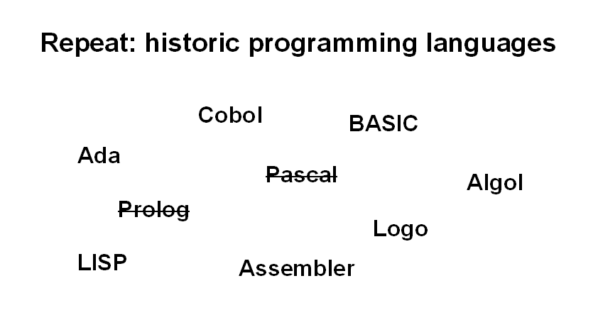

# Repeating

Repeating key concepts in increasing intervals is crucial for learning success (the scientific term for this is *"spaced repetition"*). Thus, repeating is an essential teaching activity that should not be skipped. However, repeating may be difficult to prepare, because you and your participants may be tired at the end of a day/lesson, and repeating easily falls victim to any changes to your plan. Even if everything goes well, your participants may be very eager to code to the very last minute, and interrupting them would be a pity. General strategies to deal with repeating are:

* Point students to material for self-study – works, because most online training resources do a decent job at repeating.
* Start the next lesson with it – the repetition serves as a warm-up activity
* Keep it short – one well-planned activity at the end of a lesson may prompt

In this chapter, you find a few of my favourite, foolproof methods for repeating.

----

## Check & Cross

| summary     | quick ad-hoc recap |
|-------------|--------------------|
| time        | 10' |
| preparation | 1' |
| group size  | 5-25 |
| material    | board |

* clear the board.
* write 7-15 concepts in random locations on the board
* ask everybody to explain one concept briefly
* cross out each concept that has been explained

Check & Cross helps to repeat if you have 10 minutes left at the end of your lesson. There is little that can go wrong. At worst, people start a discussion on their own. The best thing about this wrap-up technique is that you don't need to prepare anything in advance. This is why I keep this technique in my emergency kit all the time.

You can fine-tune this method by choosing easier or more difficult concepts. If the students differ much in their level of experience, ask the least experienced first.

----

## Multiple Choice Questions

| summary     | works with huge groups |
|-------------|------------------------|
| time        | 10' |
| preparation | 30' |
| group size  | 2-500 |
| material    | screen |

* write 3-5 multiple-choice questions
* display them for a 1-2 minutes each
* discuss answers with the group

MC-questions scale up very well. Their main drawback is that it takes time to craft good questions.

----

## Scrabble

| summary     | build a crossword |
|-------------|-------------------|
| time        | 10' |
| preparation |  1' |
| group size  | 3-30 |
| material    | whiteboard / flipchart |

* draw an empty Scrabble board.
* add a few bonus fields along the edges.
* write one keyword in the middle of the board.
* ask the group to suggest more words, add them in a crossword-like manner.

Don't take this exercise too seriously. You don't need to enforce rules of normal corsswords meticulously. You don't need to stick precisely to a grid when drawing characters either.

As a variation, I also used giant scrabble tiles that made from cardboard.

----

## Memory

| summary     | repeat concepts with a small group |
|-------------|------------------------------------|
| time        | 10' |
| preparation | 10' |
| group size  | 2-10 |
| material    | paper cards |

* write the names of participants on cards
* write 10-15 concepts on cards of a different color
* place the cards upside-down on a table or attach them
* one participant turns over a pair of cards (name + concept)
* the person on the card explains the concept
* that participant turns over the next pair
* do not comment on answers

I have used Memory for repeating content at the beginning and end of a lesson. At the beginning, it makes a great warm-up exercise. The memory cards are easy to prepare on-the-fly, so that you can repeat what was done during a workshop at the end of the day.

The main advantage of Memory is that everybody gets to participate. Sometimes, participants feel encouraged to help each other, in which case you can lean back and watch comfortably.

----

## Domino

| summary     | connect familiar concepts |
|-------------|---------------------------|
| time        | 10' |
| preparation | 10' |
| group size  | 2-15 |
| material    | paper cards, board or space in the middle |

* write concepts from the last lesson on the cards
* create two cards more than there are participants
* share one card to each participant
* place the first card on the board
* anyone who can explain a connection from his card to an already attached one may place his card there
* continue until everybody has placed his card

This activity has a self-balancing mechanism: The more cards are already there, the easier it will be to come up with an explanation. If someone gets really stuck, allow them to swap theirs for a spare card

----

## Telepathy

| summary     | quick team competition |
|-------------|------------------------|
| time        | 15' |
| preparation | 5' |
| group size  | 6-20 |
| material    | something to write |

* group participants to pairs
* ask participants to write down keywords for that topic within one minute
* name a topic and start a timer
* pairs get one point for each concept both participants have written
* ask for points
* play 3-4 rounds

----

## Quiz

| summary     | end-of-course wrap-up |
|-------------|-----------------------|
| time        | 45' |
| preparation | 30' |
| group size  | 5-50 |
| material    | well-visible board |

* prepare 20 quiz questions from 4-5 categories
* place all questions on the board
* ask one participant to pick a category
* read the question aloud
* give your class time to think
* ask for volunteers to answer the question
* leave room for explanations and follow-up questions
* whoever answered a question gets to pick the next category

There are a lot of variations to the quiz theme: teams, jokers, special challenges, sound effects etc.

----

## Bar Quiz

Prepare a PDF with 10-15 quiz questions.
Each question has a **point value**.
It can include many types of questions:

* Multiple Choice
* Pair Puzzle
* One-word answers
* sort the lines / words
* Debugging
* Find a word matched by the given RegEx
* Trivia (identify the person in the picture)
* Estimates (how many lines of code did Guido van Rossum contribute to cPython?)

Divide the class into teams. Give them 30-45 minutes to work on the tasks.
Depending on the difficulty, allow them to use the internet or not.
Have them hand their written answers to the next team to count points

Determine a winner.

----

## 20 Questions

| summary     | funny question-answer game |
|-------------|----------------------------|
| time        | 20' |
| preparation | 10' |
| group size  | 2-15 |
| material    | cards with concepts |

* prepare a pile of words related to your lesson
* mix in a few concepts that are not programming concepts, but have something to do with your lesson
* one participant draws a card with a concept
* the others try to guess it by asking yes/no questions

Once your participants figure out what kind of concepts the game contains, they usually build an efficient question hierarchy very quickly.

----

## Boggle

| summary     | character soup |
|-------------|----------------|
| time        | 5' |
| preparation | 5' |
| group size  | 2-50 |
| material    | screen |

* create a random 5 x 5 matrix with characters
* give participants 3 minutes to write down as many words connected with the topic
* ask for the longest words

This exercise connects easily to lessons on strings or tables. You can make creating the random matrix a homework or in-class programming task. Look up the original **Scrabble** distribution of characters for your language on Wikipedia.

----

## Carrousel

| summary     | combined energizer/recap |
|-------------|--------------------------|
| time        | 10' |
| preparation | 1' |
| group size  | 10-50 |
| material    | lots of space |

* split the class in two equal groups
* arrange the groups in two concentric circles or rows facing each other
* ask one group to explain one concept to the other
* give them roughly 30 seconds
* shift positions by one, so that everybody sees a different face
* now it is the other groups turn to explain
* play 4-6 rounds

If you have a very energetic group you can have them walk the circle or run around. See recording at the [Gulbenkian Training Programme in Bioinformatics](http://gtpb.igc.gulbenkian.pt/bicourses/)
and [video comment](http://www.youtube.com/embed/N0pPOVesDo0)

----

## Crossword

Prepare a crossword for homework. Some tools to create one are:

* http://www.theteacherscorner.net/printable-worksheets/make-your-own/crossword/crossword-puzzle-maker.php
* http://www.edhelper.com/crossword.htm
* http://www.edhelper.com/Codeword_Puzzle.htm

----

## Infographics

Place cheat sheets / infographics in the room, so that participants see them all the time. You don't have to do anything else, just let the knowledge slowly trickle in.

----

## Learning parcours

A more difficult technique is to prepare multiple exercises in the room the participants visit. Participants rotate through stations in small teams

A learning parcours allows you to recycle material the participants have already seen – many appreciate that.
Ideally, the exercises have a self-checking component.

Reserve at least one hour for a learning parcours.

----

## Extra ideas

* teamquiz: two teams, 50% of the questions go to one team, 50% to both (whoever answers faster)
* interview questions, ask participants to answer one of them in a mini-speech
* prepare questions on cards; ask participants to move around, ask someone else a question, exchange cards and move on
* mind-mapping: place a central concept (or concept map) on the board; add other concepts around it together
* 2-minute-quiz: ask participants to write down a take home message and one open question at the end of the lesson
* cut an image in 9 pieces, show 1 piece, count points down as more parts appear until participants guess it
* same, but with pixelated images that become sharper over time
* play the **Concept** board game with a small group and programming concepts
