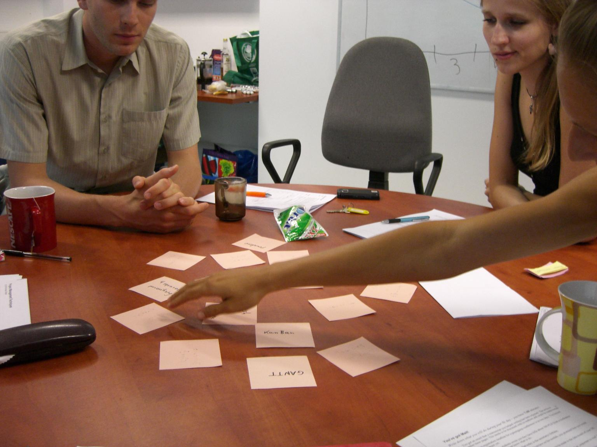

# Methods for repeating

### 20 Questions

One participant draws a card with a concept. The others try to guess what he *"is"* by asking yes/no questions.

### Concept

The board game **Concept** works with any kind of word.

### Telepathy

Group participants to pairs. Name a topic. Participants write down things around that topic within one minute.

Each pair gets points for words both have on their card.

Play 3-4 rounds

### Quiz

Prepare 20 quiz questions from 4-5 categories

Put all on the board / a slide.

Whoever answered a question gets to pick the next category

### Who wants to be a millionaire?

Prepare MC questions and have a quiz show, including 50:50 jokers and the like.

### Crossword

See:

* http://www.theteacherscorner.net/printable-worksheets/make-your-own/crossword/crossword-puzzle-maker.php
* http://www.edhelper.com/crossword.htm
* http://www.edhelper.com/Codeword_Puzzle.htm

### Hangman

Write a concept to the board as a sequence of dashes

    _ _ _ _ _ _ _ _

The participants guess characters.

### Boggle

Create a random 5 x 5 matrix with characters. Give participants 3 minutes to search words connected with the topic. Use the original **Scrabble** distribution of characters for your language.

Hint: use giant printed chars or a screen version.

## more:

* Murmur: speak 1-2 minutes with neighbor about topic (3x)
* Memory names + topics
* Tabu
* Teamquiz	50% questions to team A|B, 50% to all
* Table Topics
* pixeled images - picture becomes sharper over time
* put up infographics in the room
* one question survey. prepare questions on cards. Ask people to stand up, ask someone else a question, then exchange cards and move on.
* guess who I am with Python commands, ML methods etc.
* Quiz: who wants to be a data scientist
* Sprachlandschaft	Zentraler Begriff oder Bild kommt in die Mitte; Teilnehmer geben relevante verwandte Begriffe dazu, die im Kreis herumgeschrieben werden.
* 2-minute-quiz	Am Ende der Veranstaltung aufschreiben lassen 1.wichtigste Take Home Message 2. Noch offene Frage.
* Ping Pong: 2 groups, 2 topics, 1st asks 2nd answers for 5', then reverse
* klickspiel:  Bild in 7 Teile zersaegen, Punkte starten bei 8, pro Klick -1 Punkt, +1 Bildausschnitt

## Learning parcours

Insellernen	mehrere Stationen mit Material, die durchrotiert werden.
Lernbuffet	Stationen, die nach Belieben angefahren werden können
Werkstatt	Auftragskarten im Raum verteilt + Materialien, die die Schüler selbständig bearbeiten können. Muß selbstkontrollierbar bleiben.

## Repeating in a carrousel

**dynamic method for repeating**

### Time in class

5 minutes

### Group size

10-30

### What you need

space for people to move

### How it is done

You split the class in two groups. Both form two concentric circles or
two rows facing each other if there is less space. Instruct one group to
explain one concept to the other, give them roughly 30 seconds. Then
shift positions so that everybody sees a different face. Now it is the
other groups' turn to explain. After 5-8 rounds, your group will be well
activated.

You can put a lot of energy into the movement, see our performance at the
[Gulbenkian Training Programme in
Bioinformatics](http://gtpb.igc.gulbenkian.pt/bicourses/)

### Comments

See [video comment](http://www.youtube.com/embed/N0pPOVesDo0)

# Check & Cross

*Repeat something you know the students know well already.*

### Time in class
10'

### Preparation time
none

### Group size
2-25

### What you need
whiteboard or flipchart

### How it is done

* Clear the board.
* Write a topic as atitle on top (the title of your lesson).
* Write 7-15 concepts in random locations on the board.
* Ask everybody to explain one concept briefly. Moderate the order in which your students take turns (e.g. from left to right). You may participate in the exercise yourself.
* Cross out each concept that has been explained.

### Comments

This method helps to repeat things if you have 10 minutes left at the end of your lecture,  seminar, or workshop. There is little that can go wrong. At worst, people start a discussion on their own, but this is not so bad after all. The best thing about this wrap-up technique is that you don't need to prepare anything in advance. This is why I always keep the method as an option for Plan B.

You can fine-tune this method by choosing easier or more difficult concepts. If the students differ much in their level of experience, ask the least experienced first.

*Idea: try pictographs instead of words*
# Domino

**Repeat familiar concepts.**

### Time in class
15'

### Preparation time
10'

### Group size
2-15

### What you need

* cards (A4 paper cut by three). Two cards more than students.
* magnets or sticky tape to attach cards on the board.

### How it is done

Write concepts from the last lesson on the cards (1-2 words), Each student gets a card at random. An additional card gets attached to the board or laid on the ground. Anyone who can explain a connection from his card to an already attached one may place his card in a domino-like manner. Place the first card and explanation yourself. This process continues, until everybody has placed his card. Students may cooperate on difficult topics.

### Comments

Alternatively (and a nice set-up for an entire lesson) the class can sit in a circle with the empty space in the middle for the Domino.

### Example

In a class on Object-Oriented Programming for beginners', possible concepts are *'Class', 'method', 'inheritance', 'attribute' etc.*

# Multiple Choice Questions

Starting your lecture with questions helps your audience to warm up.
Multiple-choice questions allow you to start smoothly even with sleepy students.

See [podcast on MC questions](http://www.youtube.com/embed/GaNbZozbDzo)

# Memory

**Run through some topics with an entire group.**

### Time in class
10'

### Preparation time
5'

### Group size
2-15

### What you need
small paper cards

### How it is done

Write 10-15 concepts on cards. Place the cards upside-down on a table/whiteboard. Trainees take turns in uncovering a card and explain whatever is written there. This way, you can either *repeat* content, or collect existing knowledge. In any case, do not comment on the answers.

### Comments

I have used Memory for repeating content at the beginning and end of a lesson. At the beginning, it makes a great warm-up exercise. The memory cards are easy to prepare on-the-fly, so that you can repeat what was done during a workshop at the end of the day.

The main advantage of Memory is that everybody gets to participate. Sometimes, participants feel encouraged to help each other, in which case you can lean back and watch comfortably.

# Scrabble

**Recap some keywords.**

### Time in class
10'

### Preparation time
1'

### Group size
3-30

### What you need
whiteboard or flipchart

### How it is done
Draw an empty Scrabble board.

Write one keyword in the middle of the board. Ask the group to suggest other keywords in a crossword-like manner.

As an extra incentive, you may add some bonus fields along the edges.

### Comments

The exercise is not to be taken too seriously. You don't need to enforce rules of normal corsswords meticulously. You don't need to stick precisely to a grid when drawing characters either.

I used giant scrabble tiles that made from cardboard.
